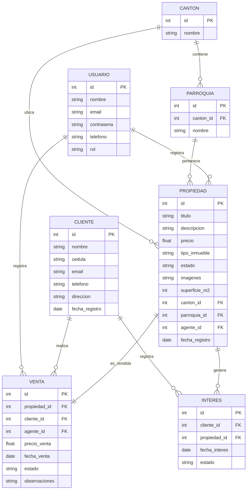

# Diagrama MER - Sistema de Gestión Inmobiliaria Bolívar

## Modelo Entidad-Relación

## Descripción de Entidades y Atributos

### 1. CANTÓN
| Atributo | Tipo | Descripción |
|----------|------|-------------|
| id | INT PK | Identificador único |
| nombre | VARCHAR | Nombre del cantón (Guaranda, Chillanes, etc.) |

### 2. PARROQUIA
| Atributo | Tipo | Descripción |
|----------|------|-------------|
| id | INT PK | Identificador único |
| nombre | VARCHAR | Nombre de la parroquia |
| canton_id | INT FK | Referencia a Cantón |

### 3. USUARIO (Agentes y Administradores)
| Atributo | Tipo | Descripción |
|----------|------|-------------|
| id | INT PK | Identificador único |
| nombre | VARCHAR | Nombre completo |
| email | VARCHAR | Correo electrónico único |
| contrasena | VARCHAR | Contraseña encriptada |
| telefono | VARCHAR | Número de contacto |
| rol | ENUM | 'agente' o 'administrador' |
| fecha_registro | DATE | Fecha de registro en el sistema |

### 4. PROPIEDAD
| Atributo | Tipo | Descripción |
|----------|------|-------------|
| id | INT PK | Identificador único |
| titulo | VARCHAR | Título de la publicación |
| descripcion | TEXT | Descripción detallada |
| precio | DECIMAL | Precio del inmueble |
| tipo_inmueble | ENUM | casa, departamento, terreno, local |
| estado | ENUM | disponible, reservada, vendida |
| imagenes | JSON | Array de URLs de imágenes |
| superficie_m2 | INT | Superficie en metros cuadrados |
| canton_id | INT FK | Ubicación cantón |
| parroquia_id | INT FK | Ubicación parroquia |
| agente_id | INT FK | Agente responsable |
| fecha_registro | DATE | Fecha de creación |
| fecha_actualizacion | DATE | Última modificación |

### 5. CLIENTE
| Atributo | Tipo | Descripción |
|----------|------|-------------|
| id | INT PK | Identificador único |
| nombre | VARCHAR | Nombre completo |
| cedula | VARCHAR | Cédula de identidad |
| email | VARCHAR | Correo electrónico |
| telefono | VARCHAR | Número de contacto |
| direccion | VARCHAR | Dirección de residencia |
| fecha_registro | DATE | Fecha de registro |

### 6. VENTA
| Atributo | Tipo | Descripción |
|----------|------|-------------|
| id | INT PK | Identificador único |
| propiedad_id | INT FK | Propiedad vendida |
| cliente_id | INT FK | Cliente comprador |
| agente_id | INT FK | Agente que cerró la venta |
| precio_venta | DECIMAL | Precio final de transacción |
| fecha_venta | DATE | Fecha de la venta |
| estado | ENUM | pendiente, completada, cancelada |
| observaciones | TEXT | Notas adicionales |

### 7. INTERES (Interés de clientes en propiedades)
| Atributo | Tipo | Descripción |
|----------|------|-------------|
| id | INT PK | Identificador único |
| cliente_id | INT FK | Cliente interesado |
| propiedad_id | INT FK | Propiedad de interés |
| fecha_interes | DATE | Fecha de registro |
| estado | ENUM | activo, atendido |

## Relaciones Principales

1. **CANTÓN → PARROQUIA** (1:N): Cada cantón de Bolívar tiene varias parroquias
2. **PROPIEDAD → CANTÓN/PARROQUIA** (N:1): Inmuebles ubicados en cantones y parroquias
3. **USUARIO → PROPIEDAD** (1:N): Agentes gestionan propiedades
4. **CLIENTE → VENTA** (1:N): Clientes pueden realizar múltiples compras
5. **PROPIEDAD → VENTA** (1:1): Cada venta corresponde a una propiedad
6. **CLIENTE → INTERES** (1:N): Clientes expresan interés en propiedades
7. **PROPIEDAD → INTERES** (1:N): Propiedades pueden generar múltiples intereses

