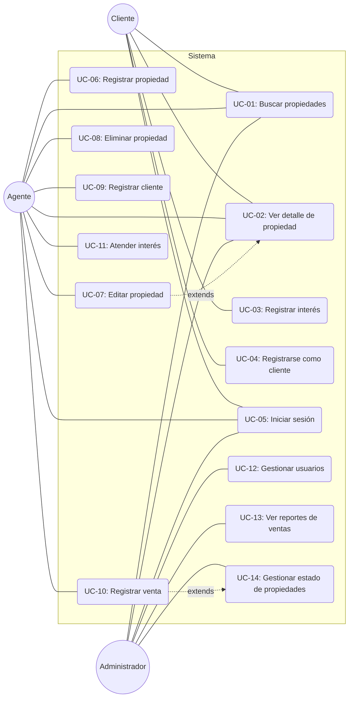
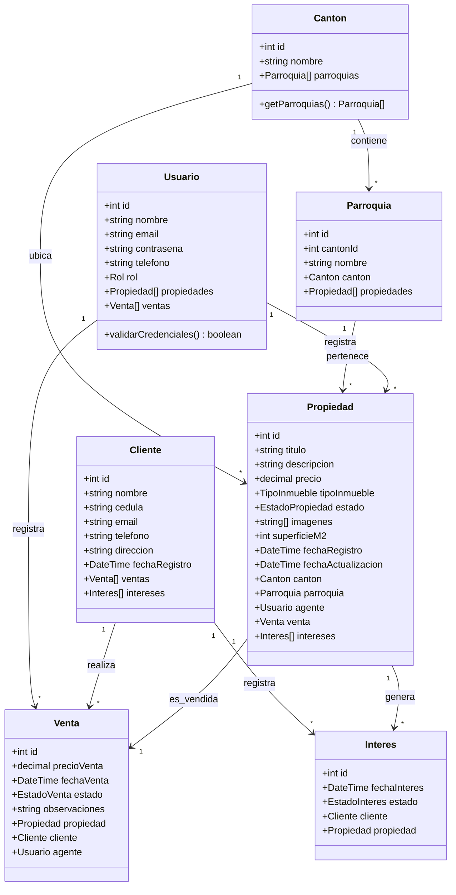
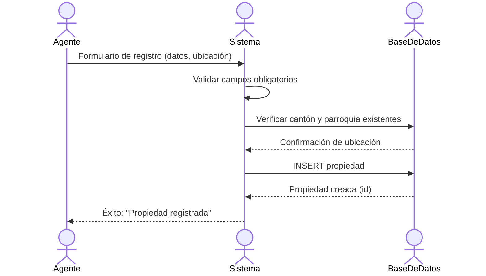
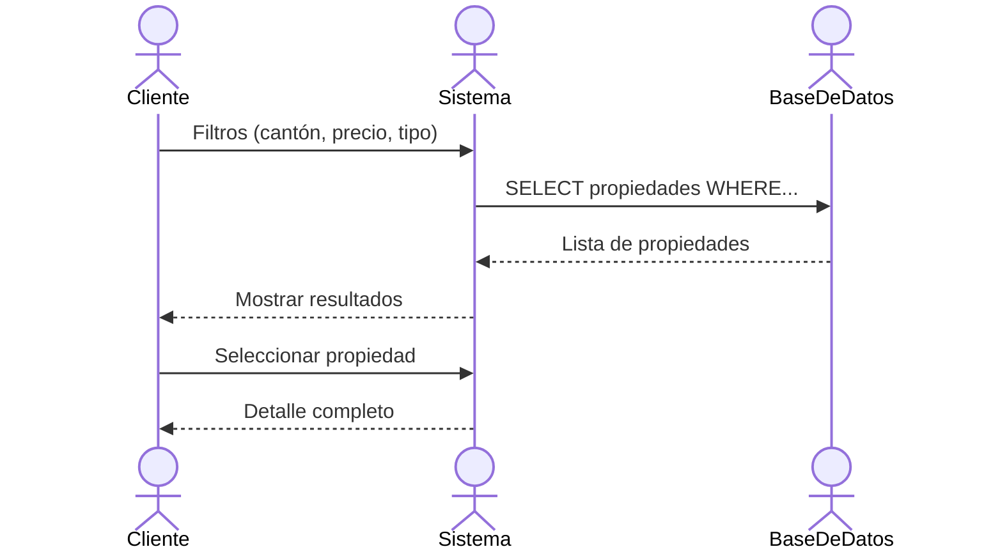
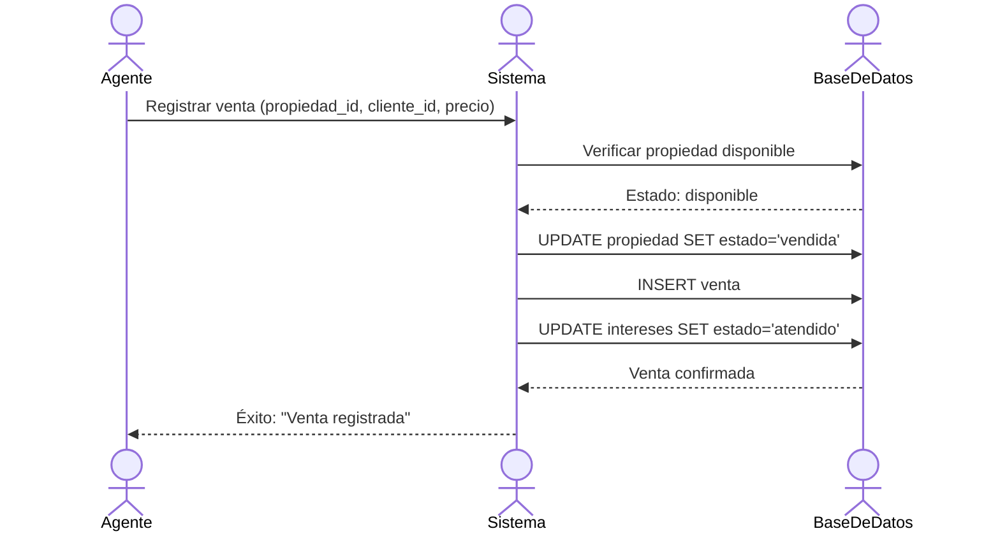
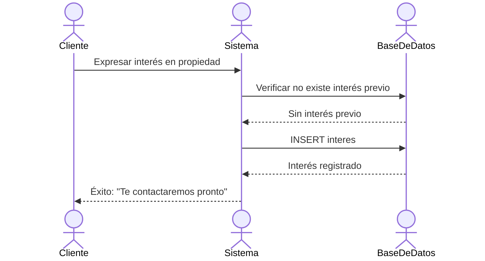
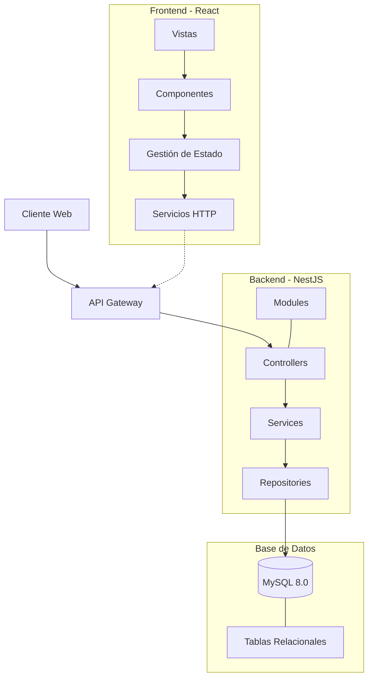
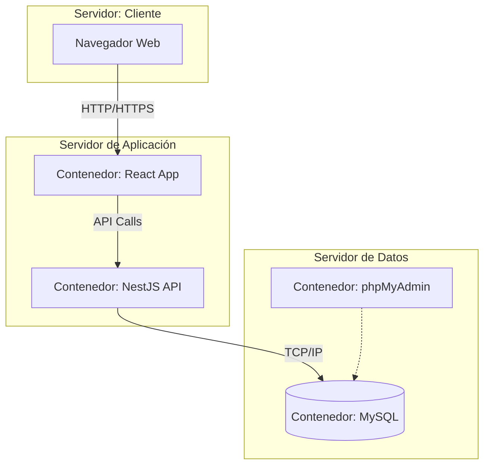

# Diagramas UML

## Tabla de Contenidos
1. [Diagrama de Casos de Uso](#1-diagrama-de-casos-de-uso)
2. [Diagrama de Clases](#2-diagrama-de-clases)
3. [Diagramas de Secuencia](#3-diagramas-de-secuencia)
4. [Diagrama de Componentes](#4-diagrama-de-componentes)
5. [Diagrama de Despliegue](#5-diagrama-de-despliegue)
6. [Modelo Cliente-Servidor](#6-modelo-cliente-servidor)

---

## 1. Diagrama de Casos de Uso



### Especificación de Casos de Uso

#### UC-01: Buscar Propiedades
| Campo | Descripción |
|-------|-------------|
| Actor | Cliente, Agente, Administrador |
| Precondición | El usuario ha iniciado sesión |
| Flujo principal | 1. Seleccionar filtros (cantón, precio, tipo)<br>2. Hacer clic en "Buscar"<br>3. Ver lista de resultados |
| Postcondición | Se muestra lista de propiedades coincidentes |

#### UC-05: Iniciar Sesión
| Campo | Descripción |
|-------|-------------|
| Actor | Cliente, Agente, Administrador |
| Precondición | El usuario tiene cuenta registrada |
| Flujo principal | 1. Ingresar email y contraseña<br>2. Validar credenciales<br>3. Redirigir según rol |
| Postcondición | Usuario accede al panel correspondiente |

---

## 2. Diagrama de Clases



### Enumeraciones

```typescript
enum Rol {
  AGENTE
  ADMINISTRADOR
}

enum TipoInmueble {
  CASA
  DEPARTAMENTO
  TERRENO
  LOCAL
}

enum EstadoPropiedad {
  DISPONIBLE
  RESERVADA
  VENDIDA
}

enum EstadoVenta {
  PENDIENTE
  COMPLETADA
  CANCELADA
}

enum EstadoInteres {
  ACTIVO
  ATENDIDO
}
```

---

## 3. Diagramas de Secuencia

### 3.1 Registro de Propiedad



### 3.2 Búsqueda de Propiedades



### 3.3 Proceso de Venta



### 3.4 Registrar Interés



---

## 4. Diagrama de Componentes



---

## 5. Diagrama de Despliegue



---

## 6. Modelo Cliente-Servidor

```
┌─────────────────┐         HTTP/REST          ┌─────────────────┐
│                 │ ◄────────────────────────► │                 │
│   React SPA     │                            │   NestJS API    │
│   (Puerto 5173) │                            │   (Puerto 3000) │
│                 │                            │                 │
└────────┬────────┘                            └────────┬────────┘
         │                                              │
         │ Axios                                        │ TypeORM
         │                                              │
         ▼                                              ▼
┌─────────────────┐                            ┌─────────────────┐
│  Estado Local   │                            │     MySQL       │
│  (React State)  │                            │   (Puerto 3306) │
└─────────────────┘                            └─────────────────┘
```

---

*Diagramas UML extraídos del documento de Análisis del Sistema de Gestión Inmobiliaria de la Provincia de Bolívar*
